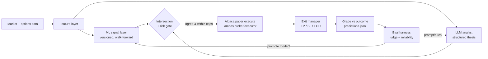

# Pivot — self-directed options swing trader (2026-06-16)

> [!important] Supersedes the 2026-04-26 framing in [[scoping]] and [[roadmap]]
> Old framing: "LLM emits a thesis, human executes manually, benchmark gates live money." New framing below, with decisions locked with Charles this session. The old docs stay as history; this is the current plan of record.

## The pivot in one paragraph

Turn `ai-trading-bot` from a recap/analyst experiment into a **self-directed, self-improving options swing trader**: it screens the market itself, forms a thesis from a **hybrid ML-signal + LLM-analyst** stack, auto-executes on **Alpaca paper** by reusing [[../lambos-trader/overview|lambos-trader]]'s already-built execution layer, grades its own trades and model versions on a loop, and is promoted to **real capital only when the paper trial clears a statistical edge gate** — targeted a few months out. The brain is new; the hands are borrowed.

## Locked decisions (2026-06-16)

| Question | Decision |
|---|---|
| Intelligence / "train itself" | **Hybrid** — ML signal layer feeds an LLM analyst; the eval/grading harness scores the combined output and drives improvement |
| Instruments | **Equity options** — long calls/puts only (bounded risk, max loss = premium). On Alpaca this needs **options Level 2** (Level 1 is only covered calls / cash-secured puts) |
| Execution + risk/sizing | **Reuse lambos-trader's Alpaca layer** — ai-trading-bot is the analyst on top of lambos's tested `broker`/`execution` modules |
| Deliverable now | **This scoping + roadmap doc** — no code yet; review before any build |

## Honest starting point — read this before anything else

> [!warning] The backtest already returned a null result
> The 2026-06-08 walk-forward battery found **no deployable edge** — weekly reversal collapsed on the survivorship-free control (−55% regime drawdown), and 12-1 momentum was the only real signal but failed the OOS control with survivorship/cost/crowding caveats. See [[backtest]]. And the only live prediction batch graded **1/4** ([[grading-review-2026-06-16]]).

This pivot does **not** assume an edge exists. It builds the apparatus to *discover and prove* one under live market conditions, behind a gate whose default answer is **"do not fund."** If the paper trial doesn't beat a naive baseline and SPY net of costs, the correct outcome is a second money-saving null result — not live capital. The value of the project either way is a rigorously evaluated answer plus reusable ML/eval/execution infrastructure.

## Architecture — the brain on lambos's hands

**Reused from [[../lambos-trader/overview|lambos-trader]] (the hands — already built and tested):**

- `trader/broker/alpaca_client.py` — Alpaca paper implementation of an abstract `Broker` (options Level 2 = long calls/puts)
- `trader/execution/risk.py` · `sizing.py` · `executor.py` · `exit_manager.py` — risk gate, contract sizing, order placement, TP/SL/EOD-close loop
- `trader/db.py` — SQLite schema + DAO; per-trade logging
- config (`pydantic` + `config.yaml`, paper/live override merge), daily summary, fleet-card heartbeat sidecar

**New in ai-trading-bot (the brain):**

1. **Data + feature layer** — market data + options chain / IV / greeks → a feature vector per candidate.
2. **ML signal layer** — model(s) producing a directional / expected-move signal with a probability, walk-forward validated, versioned in a small **model registry**.
3. **LLM analyst** — Claude synthesizes features + ML signal into a structured thesis: direction, conviction, and a concrete options structure (e.g., 30-DTE ATM call).
4. **Decision / intersection rule** — trade only when **ML signal AND LLM thesis agree** (two-signal gate, borrowed from the [[../polymarket-copy-trader/overview|polymarket]] sibling), inside lambos's risk caps.
5. **Eval / self-improvement loop** — grade every call to `predictions.jsonl`, provider-aware judge + reliability tracking, model promotion gated on sealed OOS.

## How "train itself" works — the two loops

**1. LLM self-improvement loop (fast, ~weekly).** Graded predictions → calibration analysis (does stated conviction track realized hit rate?) + which-signals-actually-pay → update the analyst prompt and strategy rules. No model training; this is prompt/policy learning from the grading log. Most of this harness already exists (`ceo_report.py` judge, `predictions.jsonl`).

**2. ML retrain loop (slow, gated).** Rolling-window retrain → walk-forward OOS validation against the **incumbent model** and a **naive baseline** → promote a new version **only if** it beats both on sealed data with positive expectancy after modeled costs → registry version bump, logged. Hard guards against the three failure modes [[scoping]] already names and the backtest already hit: look-ahead bias (sealed test windows), survivorship bias (point-in-time universe, include the misses), overfitting (OOS + significance, no peeking).

**Self-eval.** The bot scores its own paper P&L weekly, broken down per strategy and per model version; the eval harness is the referee. Promotion and funding are **always gated, never automatic** — the loop proposes, the gate disposes.

## Options & data reality

- **Alpaca paper options = Level 2 (long calls/puts).** No spreads, no short premium in v1. That's a feature for safety: every position has bounded, premium-capped risk and is trivial to grade. (Level 1 is only covered calls / cash-secured puts; spreads/condors need Level 3.)
- **Options data is a real dependency.** Chains, IV, and greeks drive the features. `yfinance` options data is thin and laggy; budget for a proper options feed (Polygon / Tradier / Theta Data, ~$30–100/mo) once features need it. This is the main new running cost. Until then, prototype features on equities + delayed chains.
- **Swing horizon only** (multi-day holds). LLM/ML latency rules out intraday — consistent with the original scope.

## The go-live gate (the part that actually matters)

> [!important] Real capital only when ALL of these hold — target ≈ 3 months of daily paper
> 1. **Volume:** ≥ ~60–100 graded paper trades across ≥ 2 months of *distinct* market conditions.
> 2. **Profitability:** positive realized paper P&L **net of modeled slippage + commissions**.
> 3. **Beats baselines:** outperforms (a) naive "buy ATM call on every signal" and (b) SPY buy-and-hold over the same window, risk-adjusted.
> 4. **Calibration:** stated conviction tracks realized hit rate (reliability stable, not drifting).
> 5. **Written live config:** a data-backed spec — universe, caps, exits, the specific model version — you'd defend with money.
> 6. **Drawdown** within a pre-declared cap throughout.

> [!warning] Execution boundary
> I can build and run the **paper** loop end-to-end with you. **Going live is your action:** you generate live Alpaca keys, flip `ALPACA_PAPER=false`, fund at deliberately tiny caps, and watch the first trades by hand. I will not place real-money orders or move funds on your behalf — I help build, monitor, and review; you enable and run live.

## Phased roadmap

> [!info] Kill-switch at every gate. The dominant risk in personal algo trading is impatience; the phasing exists to fail fast and cheap.

**Phase 0 — Execution-reuse spike + paper skeleton (~1 week)**
Stand up the borrowed lambos execution core in this repo, place a hand-specified paper options order end-to-end, confirm exits fire.
- [ ] Decide reuse mechanics (shared package vs vendored copy — see below)
- [ ] Wire `Broker`/`alpaca_client` + `executor`/`exit_manager` against a **separate** Alpaca paper account
- [ ] Place one manual paper call, confirm TP/SL/EOD exit + SQLite logging
- *Kill:* if the Alpaca options paper surface can't place/manage a long call reliably, stop and reassess the venue.

**Phase 1 — Data + feature + ML signal layer (~2 weeks)**
- [ ] Options/equity data ingest + feature builder (IV, greeks, momentum, flow)
- [ ] First ML signal model + **walk-forward OOS** harness reusing [[backtest]] discipline
- [ ] Model registry + promotion rule (beat incumbent + baseline on sealed data)
- *Kill:* if no signal beats the naive baseline OOS after honest de-biasing, **stop** — this is the backtest's lesson; don't paper-trade noise.

**Phase 2 — LLM analyst + intersection + paper auto-execute (~1–2 weeks)**
- [ ] LLM thesis call (structured JSON: direction, conviction, options structure)
- [ ] Intersection rule (ML ∧ LLM) + risk-cap gate → auto-place on paper
- [ ] Log every call to `predictions.jsonl`; nightly grading; fleet-card eval score
- *Kill:* if >20% of theses show look-ahead/hallucination, fix the prompt before trusting it.

**Phase 3 — Daily paper trial + self-improvement loop (~3 months, calendar-bound) — the real test**
- [ ] Run the full pipeline every trading day, unattended, logged
- [ ] Weekly eval cycle: P&L + calibration + per-model-version → prompt/rule updates + gated retrains, with a written paper trail
- [ ] Track progress on a ceos-enterprise fleet card toward the go-live date
- *Kill:* negative paper P&L net of costs, or no edge vs baseline → second null result, do not fund.

**Phase 4 — Go-live gate review → small-size live (user-funded)**
- [ ] Consolidate the written live config; confirm all six gate conditions
- [ ] **You** flip to live keys, tiny caps, hand-watch week one; daily intended-vs-actual fill reconciliation
- *Kill:* live slippage eats >~10% of expected edge → execution surface broken, fix or stop.

**Phase 5 — Scale (open-ended).** Only after 0–4 pass: raise size, expand universe, consider an options Level 3 (spreads / defined-risk short premium) upgrade and an ensemble second-opinion LLM.

Suggested calendar: this trails lambos-trader's **Aug 20** live date — a realistic go-live target here is **mid-to-late September 2026** if Phases 0–2 land in the next few weeks and the paper trial runs clean.

## Reuse mechanics — one open decision

Two ways to borrow lambos's hands:

- **Shared local package (recommended):** extract lambos `trader/broker` + `trader/execution` into a small package both repos import. Avoids two diverging Alpaca stacks; one place to fix a bug. Cost: a modest refactor of lambos (which is mid-trial — touch carefully, behind tests).
- **Vendored snapshot:** copy the modules into ai-trading-bot now, reconcile later. Faster to start; risks drift.

> [!check] Resolved by the Phase-0 spike
> The lambos code has now been read — see **[[phase0-execution-reuse-2026-06-16]]** for the per-file lift/refactor/leave map. Verdict: `broker/` + `execution/` are cleanly reusable; the only seam is a new `TradeIntent` dataclass. Recommended mechanic: **shared `trader_core` package, tests-gated** (vendor as fallback).

## Strategy / portfolio implication — needs your call

This **un-pauses trading-research build work**, which [[../../strategy|strategy.md]] currently gates behind "first revenue." With lambos going live Aug 20 and this one targeting ~September, two trading projects would both be marching toward live capital while the revenue gates (shopify ad, berkeley cohort, reta charge code) remain unmet. Options:

1. **Keep at 0% / nights-and-weekends research** until a revenue Phase 0 clears (recommended — consistent with the current sprint posture; the paper trial is mostly unattended calendar time anyway).
2. Carve explicit weekly time now (reduces revenue focus).
3. Fold it into the chosen evals/ML "deep-focus" learning track alongside [[../../research/ai-evals/README|ai-evals]].

I have **not** edited `strategy.md`. Tell me which and I'll log the decision + (if relevant) adjust allocation.

## Open questions

1. Reuse: shared package vs vendored copy?
2. Options data feed + monthly budget (Polygon / Tradier / Theta)?
3. Underlying universe — which tickers (liquid optionable names: mega-cap tech + ETFs)?
4. Target go-live date — anchor to ~September, or run longer?
5. Separate Alpaca paper account from lambos? (Recommended — clean P&L attribution.)
6. Strategy posture (above).

## Strategy evidence (2026-06-16)

The "what to actually trade" question is researched in **[[strategy-research-2026-06-16]]**. Headline: net of option spreads + decay the average edge is ~0, and the strongest options edge (VRP) rewards *sellers* — so a Level-2 long-only bot fights a structural headwind. Recommended Phase-1 strategy: **post-earnings drift entered after the IV crush** on liquid names, with momentum/52-wk-high and the call−put volatility spread as confirming features, and a serious recommendation to scope the **Level-2 defined-risk short-premium** path as the real long-term edge. This sharpens Phase 1 of the roadmap above and answers open question #3 (universe = liquid optionable large-caps/ETFs).

## See also

- [[strategy-research-2026-06-16]] — the strategy evidence base feeding Phase 1
- [[overview]] · [[scoping]] (superseded framing) · [[roadmap]] (superseded) · [[architecture]]
- [[backtest]] — the null result this pivot must respect · [[grading-review-2026-06-16]]
- [[../lambos-trader/overview|lambos-trader]] — the execution layer being reused
- [[prediction-loop]] · [[eval-reporting]] — the grading harness the self-eval loop builds on
